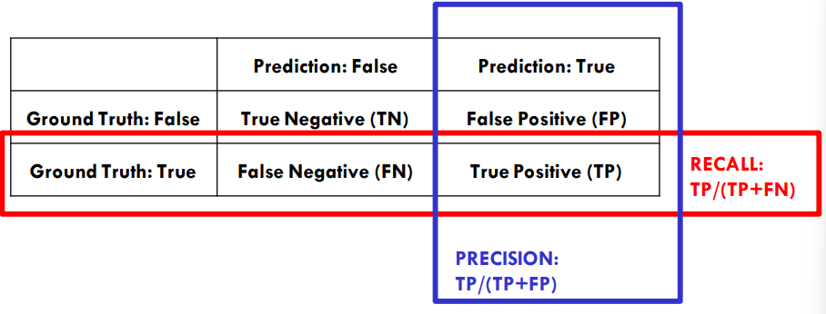

# Text Categorization and Naïve Bayes

[toc]

## Text Categorization

- the classifier
  - *input*: a document $x$
  - *output*: a predicted class $y$ from some fixed set of labels $y_1,...,y_k$
- the learner:
  - *input*: a set of $m$ hand-labeled documents $(x_1,y_1),...,(x_m,y_m)$
  - *output*: a learned classifier $f:x\rightarrow y$

### Representing Text for Classification 


#### Bag of words representation


#### Bag of N-grams


- some benefits of using N-grams instead of just single words
  - detect collections
  - detect negation and local context
  - increase vocabulary size

---

## Naïve Bayes

### Text Classification with Naïve Bayes

- represent document $x$ as a set of $(w_i, \text{count}(w_i))$ pairs
  - example $x = \{(\text{grain}, 3), (\text{wheat}, 1)...\}$
- for each $y$, build a probabilistic model $P(X|Y=y)$ of "documents" in class $y$
  - i.e. what is probability of observing document $x$ given that the class *was actually* $y$ 
- to classify, find the $y$ which was most likely to generate $x$

#### Bayes Rule

$$
P(y|x) = \frac{P(x|y)P(y)}{P(x)}\\
\underset{y}{\text{argmax }}P(y|x) = \underset{y}{\text{argmax }}P(x|y)P(y)
$$

- where our hidden class is $y$ and our context that we can observe is $x$

#### Two Unreasonable Assumptions

1. bag-of-words: the order of words in the document makes no difference (but repetitions do)
2. conditional independence: words appear independently of each other given the document class
   - if you see "car", the word "drive" is no more likely to appear than if you saw "dog"

#### How to estimate $P(X|Y)$?

$$
P(w_1,...,w_n|Y=y) = \prod_{i=1}^n P(w_i|y)
$$

- estimate $P(W|Y)$ with data

$$
P(w_i|Y=y) = \frac{\text{count}(w_i \and Y=y)}{\text{count}(Y=y)}
$$

#### Simple Smoothing

- if $X$ contains a vocabulary word that doesn't occur with class $Y=y$ in the training data then $P(X|Y=y)=0$ no matter what <span style="color:crimson">(this is an issue)</span>
- solution:
  - assign small probability to unseen words
  - taking away probability from seen words
  - every word that occurred $N$ times with class $Y=y$, we will pretend actually occurred $N+\alpha$ times ($\alpha$ is actually a parameter in NLTK's implementation of Naive Bayes)

#### N-gram Smoothing

- goal: estimate the probability of N-grams with 0 count
- Witten-Bell smoothing
  - interpolates probabilities between order $n$ & $n-1$
  - N-grams with 0 counts assigned a non-zero probability based on lower-order N-gram counts

#### How to estimate $P(X|Y)$ (again)?

$$
P(w_i|Y=y) = \frac{\text{count}(w_i \and Y=y) + \alpha}{\text{count}(Y=y) + \alpha |V|}
$$

- example value is $\alpha = 3$

#### Avoiding Underflow

- consider:
  - many documents have more than 100 words
  - word probabilities will each be $<0.1$
  - so $P(x|Y)<10^{-100}$ for any document $x$ <span style="color:crimson">`underflow error!`</span>
- solution: work in log space
  - use $\log[P(X|Y)P(Y)] = \log P(X|Y)+\log P(Y)$
  - $\log P(X|Y) = \sum_{w_i \in X} P(w_i|Y)$

#### Okay, so how do I classify?

```pseudocode
for each document x_i with label y_i:
	d_count[y_i]++
	d_count++
	for each word w_ij in x_i:
		w_count[w_ij][y_i]++
		w_count[y_i]++
```

- to classify a new $x=w_1,...,w_n$ pick the $y$ with the top score

$$
\text{score}(y,w_1,...,w_n) = \log \frac{\text{d\_count}[y]}{\text{d\_count}} + \sum_{i=1}^n \log \frac{\text{w\_count}[w_i][y] + \alpha }{\text{w\_count}[y] + \alpha |V|}
$$

### Naive Bayes Summary

- pros:
  - very fast & easy-to-implement
  - well-understood formally & experimentally
- cons:
  - generally doesn't give the best performance
  - "probabilities" $P(y|x)$ are not accurate

---

## Alternate Bag-of-Words Methods

### Gradient Boosting Machine GBM

- ensemble method based on decision trees
- gradient boosting: build models that sequentially correct errors of previous model
- benefits for NLP:
  - easy to blend text & structured data inputs
    - handles outliers well without preprocessing
  - mostly interpretable
  - trains (relatively) quickly 

### Support Vector Machines SVMs

- goal: minimize separation between classes


---

## Metrics: Binary Classification


$$
\text{Recall} = \text{TP} / (\text{TP} + \text{FN})\\
\text{Precision} = \text{TP} / (\text{TP} + \text{FP})\\\\
\text{F1} = 2 * P * R / (P+R)\\
$$

- F1-Beta score $ = (1+ \beta^2) * P * R / (\beta^2 * P + R)$