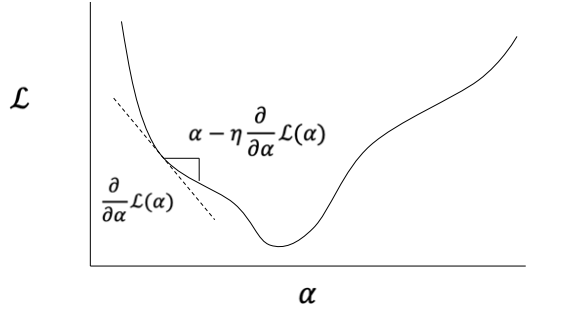
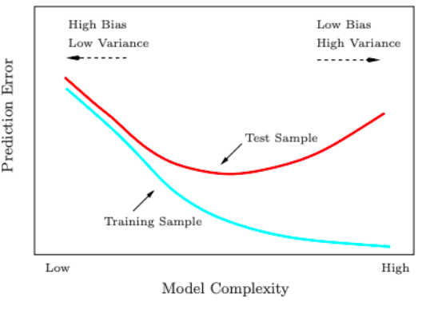

# Generalized Linear Models

[toc]

## Statistical learning for classification

- text categorization is a classification task
  - associate every document with a class label 
- one way to do this is [Naive Bayes](8-Text-Categorization-and-Naïve-Bayes.md)
- a document is represented as a vector $\vec x$ of features
  - $X$ is a RV ranging over values of $\vec x$
- label for each document is a categorical value $y\in Y$
  - $Y$ is a RV ranging over values of $y$
- we have a training set of labeled documents
  - $(\vec x_1, y_1),(\vec x_2, y_2),...,(\vec x_N, y_N)$
- goal is to identify some scoring function $\Psi(\vec x,y;\theta)$
  - $\Psi$ tells us how compatible $\vec x$ is with the label $y$
  - $\theta$ is the **set of parameters** we can adaptively modify to change

### Linear Models

- classification rule is
  - $\hat y = \underset{y\in Y}{\text{argmax }}\Psi(\vec x,y;\theta)$
- in the case of a linear model
  - $\Psi(\vec x,y;\theta) = \theta^\top f(\vec x,y)$
- typically, the feature vector $f(\vec x)$ represents each value of $\vec x$ in combination with each class $y$

## Generalized Linear Models GLMs

- a framework for associating linear functions with distributions for use in optimization / estimation
- idea: define a **link function** $g$ that determines the relationship between the score function $\Psi$ (linear model) & the expected value of the distribution we are interested in

$$
g(E[Y=y|X=\vec x]) = \theta^\top f(\vec x,y)
$$

- for linear regression, $g$ is the identity function, so the linear model provides our estimate directly

### Logistic Regression

$$
g(E[\cdot]) = \ln(\frac{E[\cdot]}{1-E[\cdot]}) = \theta^\top f(\vec x,y)
$$

- the expectation is the estimate of a probability distribution over 2 outcomes, so

$$
\ln(\frac{P(Y=1|X=\vec x)}{1-P(Y=1|X=\vec x)}) = \theta^\top f(\vec x,y)\\
$$

- *note* that $1-P(Y=1|X=\vec x) = P(Y=0|X=\vec x)$
- the **logit function** is the link that transforms our probabilities into the linear output of our model
- to get from the linear outputs to probability space, we can use **inverse logit** (a.k.a. sigmoid squashing function)

$$
P(Y=1|X=\vec x) = \frac{e^{\theta^\top f(\vec x,y)}}{1+e^{\theta^\top f(\vec x,y)}}
$$

#### Inverse Logit & SoftMax

- inverse logit maps from linear outputs to normalized probabilities for binary classification 
- what if we have more that 2 classes? **categorical logistic regression**
- SoftMax: (also recall from [`word2vec`](6-Neural-Word-Embeddings.md#SoftMax))

$$
P(Y=y|X=\vec x) =  \frac{e^{\theta^\top f(\vec x,y)}}
{\sum_{y'\in Y} e^{\theta^\top f(\vec x,y')}}, Y=\{y_1,y_2,...,y_N\}
$$

#### Maximum Likelihood Estimation

- for categorical logistic regression, the probability of an observed label $y$ given the features / words $x$ is

$$
P(Y=y|X=\vec x) =  \frac{e^{\theta^\top f(\vec x,y)}}
{\sum_{y'\in Y} e^{\theta^\top f(\vec x,y')}}
$$

- if we aggregate this over all training examples, we get the *likelihood*

$$
L(\theta) = \prod_{i=1}^N P(y_i|\vec x; \theta)
$$

- to choose parameters $\theta$, choose the value of $\theta$ that maximizes the likelihood estimate $L(\theta)$

$$
\theta = \underset{\theta}{\text{argmax }}L(\theta)\\
= \underset{\theta}{\text{argmax }}\prod_{i=1}^N P(y_i|\vec x; \theta)\\
= \underset{\theta}{\text{argmax }}\sum_{i=1}^N(\theta^\top f(\vec x_i,y_i) - \log\sum_{y'\in Y}e^{\theta^\top f(\vec x_i,y')})
$$

#### Optimization

- to find the $\theta$ to maximize $\sum_{i=1}^N(\theta^\top f(\vec x_i,y_i) - \log\sum_{y'\in Y}e^{\theta^\top f(\vec x_i,y')})$
  - use *gradient descent* to **minimize <u>negative</u> log likelihood**

#### Overfitting

- in NLP, we usually have large feature sets
  - if every word is a feature, we have $|V|$ features
- usually $|V| > |D|$ (a lot bigger than number of documents)
  - the model may be able to learn the characteristics of the training documents exactly ("memorize" it)
- however, training data performance is near-perfect, but testing data performance degrades
  - model fails to *generalize* 

- in terms of *model complexity* with bag-of-word text categorizations, when adding bi-grams and tri-grams we had a large increase in vocabulary size greatly 
  - and thus *number of parameters* and model complexity

---

## Dealing with Overfitting

1. get more data (increase $|D|$)
2. simplify model (decrease $|V|$)
3. use regularization (constraint $\theta$)

### Regularization

- Bias-Variance tradeoff
  - **bias** parameters should stay within "reasonable" bounds
    - not too many of them should be too large
  - **variance** parameters should be allowed to *vary* to capture the observed structure of the training data
- **regularization** is a mechanism for *increasing bias at the expense of variance*

### L~2~ Regularization for Logistic Regression

- discourage model weights from getting too large by adding a penalty on the norm of the parameter vector $\theta$
- instead of maximizing log likelihood, minimize the penalized negative log likelihood

$$
\log L(\theta) = -\sum_{i=1}^N \log P(y_i|\vec x_i;\theta) + \frac{\lambda}{2}||\theta||^2
$$

- the $\frac \lambda 2 ||\theta||^2$ is the **ridge penalty**

### L~1~ Regularization for Logistic Regression

$$
\log L(\theta) = -\sum_{i=1}^N \log P(y_i|\vec x_i;\theta) + \lambda||\theta||
$$

- **L~1~ penalty** is sum of absolute values of coefficients 
- encourages sparsity by pushing coefficients toward zero (i.e. *feature selection*)
