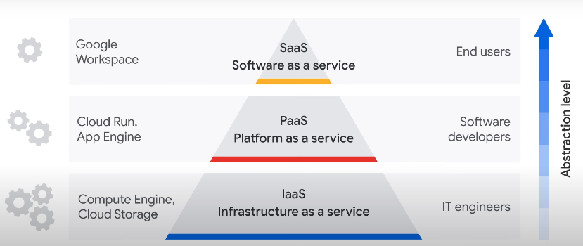
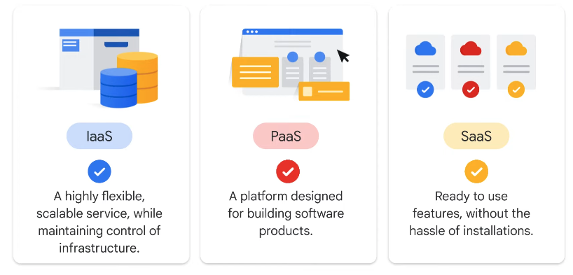
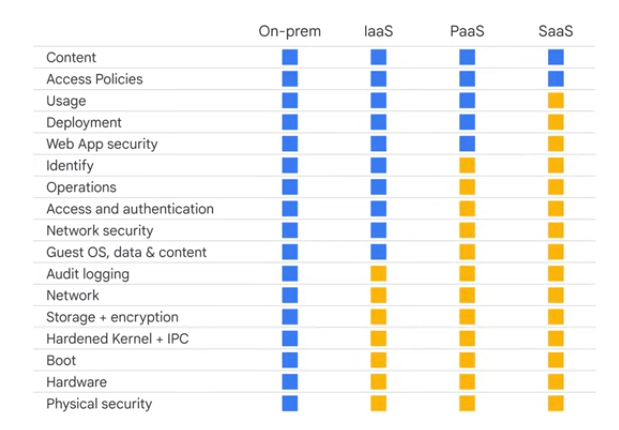

# Cloud Computing Models and Shared Responsibility

## [Cloud computing service models](https://www.youtube.com/watch?v=ZHBcihFyoTk)

- different cloud computing models offered as a service by providers
- "as a service" refers to how IT resources are consumed

- On-prem is like owning a car
  - you're responsible for usage and maintenance
  - upgrading means buying a new car
- IaaS is like leasing a car
  - you can drive it where you want
  - to upgrade, you lease a new car
- PaaS is like taking a taxi
  - you provide instructions on where to go
  - but driver does the driving
- SaaS is like going by bus
  - less customizable
  - shared space

----

## [IaaS (Infrastructure as a service)](https://www.youtube.com/watch?v=wzvpVK7peCw)

- offers on-demaind availability of almost infinitely scalable resources
  - such as compute, networking, storage, databases
  - all over the internet
  - lease resources and only pay for what you use
- provides same technologies & capabilities without having to pay or maintain it all
- main reasons organizations use IaaS to shift from CapEx to OpEx

### Google Cloud Examples

- *Compute Engine* for VMs
- *Cloud Storage* for any kind of data

### Benefits

- economical
  - only pay for what you use
  - easy to budge for
- efficient
  - resources are readily available
  - fewer delays when you need to scale
- boosts productivity
  - because cloud provider is responsible for maintenance, organizations can redirect resources to more strategic activities
- reliable
  - no single point of failure

- scalable

### Good for organizations that

- have unpredictable workload volumes and spikes in demand
- require more infrastructure scalability and agility
- have high business growth
- low utilization of existing infrastructure resources

-----

## [PaaS (Platform as a service)](https://www.youtube.com/watch?v=44JmErjQj64)

- provides a platform for developers to develop, run, and manage their own applications
- no need to build & maintain the infrastructure
- can use built-in software components
- reduces the amount of code they need to write

### Google Cloud examples

- Cloud Run
  - server-less platform
  - develop and host applications that scale on demand
- BigQuery
  - enterprise data warehouse
  - manage and analyze data
  - no infrastructure management

### Benefits

- reduces development time
  - developers can go straight to coding
  - no need to set up environment
  - faster market time
- scalable
  - organizations can purchase additional capacity when needed
  - take advantage of inherit scalability in cloud infrastructure
- reduces management
- flexible
  - support for different programming languages
  - developers can make different applications on the same platform

### Good for organizations that

- create unique and custom applications without owning and managing infrastructure
- rapidly test and deploy applications
- have legacy applications and want to reduct cost of operations
- want to only pay for resources being used
- want to offload time used to setup environments

-----

## [SaaS (Software as a service)](https://www.youtube.com/watch?v=BTqNnlvkK1I)

- a computing model that offers an entire application offered by a cloud provider through a web browser
- abstracts technology completely from a consumer
- no download or installation is required

### Google Cloud examples

- Google Workspace which includes Gmail, Drive, Meet, etc...

### Benefits

- low maintenance 
  - eliminates need for IT to download & install products
  - vendors manage all potential technical issues
  - helps streamline maintenance and support 
- cost effective
  - fixed monthly or annual account fee
  - predictable costs and per-user budgeting
- flexible
  - everything is available from the internet

### Good for organizations that

- want to use standard software solutions with minimal customization
- don't want to invest in maintenance and infrastructure
- need IT teams to focus on strategic projects
- needs to access apps from various devices & locations

-----

## [Choosing a cloud computing model](https://www.youtube.com/watch?v=DFd0ulad7tY)

-  most organizations will use a combinations of all 3

----

## [The shared responsibility model](https://www.youtube.com/watch?v=WCSvQ8Ijj9k)

- security in the cloud is a shared responsibility between the cloud provider and the customer
  -  provider is responsible for security of the cloud
  - customer is responsible for security in the cloud

----

## [How the shared responsibility model works](https://www.youtube.com/watch?v=9OEG-XSQjKM)

> If you configure or store it, you're responsible for securing it.

| **cloud provider** | customer        |
| ------------------ | --------------- |
| hardware           | configurations  |
| networks           | access policies |
| physical security  | user data       |

- where the orange is Google's responsibility and the blue is the customer's
- customers **are always** responsible for the security of their data

