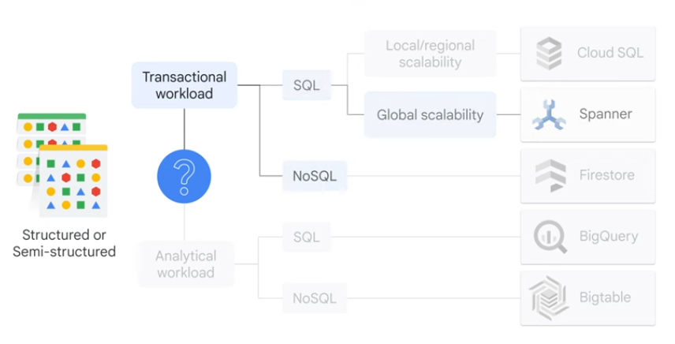

# Google Cloud Data Management Solutions

## [Unstructured data storage](https://www.youtube.com/watch?v=uecOHbCn1Kk)

### Object Storage

- a computer data storage architecture that manages data as “objects”
- instead of as file storage, 
  - which is a file and folder hierarchy
- or as block storage, 
  - which is chunks of a disk
- object packaged format contains
  - binary form of actual data
  - relevant metadata (like creation date, author, permissions)
  - globally unique identifier in the form of URLs making it easy to integrate with web technologies
- data commonly stored as objects include
  - videos
  - pictures
  - audio
- this data is referred to as unstructured

### Cloud Storage

- **Google Cloud Storage** allows customers to store any amount of data 
  - and to retrieve it as often as needed
- fully managed scalable services that has a wide variety of uses
- there are 4 primary storage classes in cloud strage

#### Standard storage

- good for hot data
  - frequently accessed
  - or stored for brief period of time

#### Nearline storage

- good for infrequently accessed data
  - like once a month or less
- such as backups or archives

### Coldline storage

- like nearline but at most every 90 days

### Archive storage

- less than once a year 

### All have

- unlimited storage
- worldwide accessibility
- low latency & high durability
- uniform experience
- geo-redundancy

### Autoclass

- a features that moves data not accessed to colder storage classes to reduce storage cost
- moves data that is accessed to standard storage to optimize future access

---

## [Structured data storage](https://www.youtube.com/watch?v=bv3kk26MKbo)

### Google Cloud SQL

- **Google Cloud SQL** offers fully managed relation databases including MySQL, PostgreSQL, and SQL Server
- gives the mundane tasks like 
  - applying patches/updates
  - managing backups
  - configuring replications
  - all to Google
- Cloud SQL is trusted by thousands of organizations and provides benefits like
  - doesn't require software installation or maintenance
  - supports backups
  - encrypts customer data
  - includes network firewall
- DMS (database migration service) makes it easy to migrate production databases to Cloud SQL with minimum down time 

### Google Cloud Spanner

- relational database service that is
  - fully managed
  - mission critical
  - scales horizontal
- best for applications that require
  - SQL relational database management systems with joins and secondary indexes
  - built-in high availablity
  - strong global consistency
    - high numbers of I/O per second 

### How does Spanner differ from Cloud SQL?

- use Spanner if
  - have outgrown any relational database
  - are sharding your databases for throughput high performance
  - need transactional consistency
- use Cloud SQL if
  - don't need horizontal scalng
  - don't need globally available system

### BigQuery

- fully managed data warehouse
- provides 2 services in 1
  1. storage
     - can store petabytes of data
     - a petabyte is ~11,000 movies at 4K
  2. analytics 
     - ML
     - geospatial analysis
     - BI
- data is **encrypted at rest**
  - meaning it uses encrypting to protect data that's stored on disk
  - including SSD or backup media
- provides seamless integration with partner ecosystem
- works in multi-cloud environment
- built-in ML functions
  - you can make ML models with SQL alone
  - can also seamless export datasets into **Vertex AI**

----

## [Semi-structured data storage](https://www.youtube.com/watch?v=4VsDFu2U1fQ)

- semi-structured data is easier to organize as it usually has tags or metadata
  - for example, an email

### Google Firestore 

- flexible, horizontally scaling, NoSQL cloud database
- can be directly accessed from mobile and web applications
- provides off-line usage so users can use apps even if disconnected from the Internet

### Big Table

- NoSQL big data database service
- same database that powers things like Google Search, Analytics, and Gmail
- designed to 
  - handle large workloads
  - consistent low latency
  - high throughput
- use if
  - working with more than 1 TB of semi-structured or unstructured data
  - data is fast with high throughput or is rapidly changing
  - working with NoSQL
  - data is a time-series or had natural ordering
  - you're running batch or real-time processing on big data
  - you're running ML algorithms on the data 

---

## [Choosing the right storage product](https://www.youtube.com/watch?v=uLnawxRHfrg)

- if unstructured data
  - use *Cloud Storage*
  - decide a storage class (or let Autoclass decide)
- if structured or semi-structured data
  - is transactional workload?
    - stems from OLTP (online transaction processing)
      - fast data inserts and updates are required to build row-based records
      - i.e. points of sale transaction records
  - is analytical workload?
    - stems from OLAP (online analytical processing)
      - used when entire datasets need to be read
      - often requires complex queries 
      - i.e. analyzing sales history to see trends

----

## [Database migration and modernization](https://www.youtube.com/watch?v=dQHhvW_kJDE)

### Lift and shift

- databases are migrated from on-prem to the same type of database hosted by a provider
- cons
  - databases are more difficult to modernize
- pros
  - minimal upheaval
  - managed by cloud provider

### Managed database migration 

- SQL Server, MySQL, PostgreSQL migrates to a fully managed Google Cloud database
- cons
  - requires careful planning
  - may cause slight upheaval
- pros
  - focus on higher priority work
- **Google DMS** or database migration service can easily migrate your database to Google Cloud
- **Google Datastream** uses to synchronize data across databases, storage systems, and applications