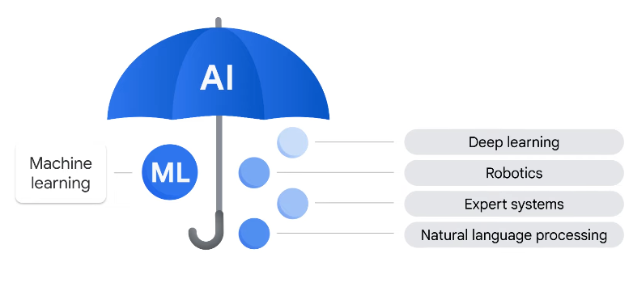

# AI and ML Fundamentals

## [AI and ML defined](https://www.youtube.com/watch?v=nswX4PxepF8)

- **Artificial intelligence** is a broad field which refers to the use of technologies to build machines and computers that can mimic cognitive functions associated with human intelligence
- **Machine learning** is a subset of AI that lets a machine learn from data without being explicitly programmed

---

## [Problems that ML is suited to solve](https://www.youtube.com/watch?v=19ZW93WgRVc)

### Replacing or simplifying rule based systems

- imagine a user searches "Giants" on Google
- should the results return San Fransisco Giants, New York, Giants
- initially, the search can check the user's location to decide
- but a rule-based system quickly expands complexity with the many possible searches
- ML can use users clicks to train a model to rank search results 

### Automate processes 

- ML is designed to make predictions and repeated decisions at scale

###  Understanding unstructured data

- for example, finding sentiment of support emails to route to the right department

### Personalization

- ML can service product recommendations

---

## [Why ML requires high-quality data](https://www.youtube.com/watch?v=U2uRKFmhK_Q)

- accuracy of predictions relies on the quality of data
- data is low-quality if its
  - not aligned to the problem
  - biased in some way
-  to assess data quality, it can be evaluated on 6 dimensions

### Completeness

- refers to whether all required information is present

### Uniqueness

- dataset shouldn't have many duplicates

### Timeliness

- data reflects current state of phenomenon that is being modeled

### Validity

- data conforms to a set of predefined standards and definitions such as type and format
  - such as a date being in the wrong form

### Accuracy

- correctness of the data
  - such as a dog being labeled `cat`

### Consistency

- whether the data is uniform and doesn't contain contradictory information

----

## [The importance of responsible and explainable AI](https://www.youtube.com/watch?v=vsTcfwKXbrw)

- Google's principles for AI state is should
  - be socially beneficial
  - avoid creating or reinforcing unfair bias
  -  be built and tested for safety
  -  be accountable to people
  - incorporate privacy design principles
  - uphold high standards of scientific excellence
- Google won't use AI for evil stuff and urges other organizations not to use AI for evil stuff ❤️

