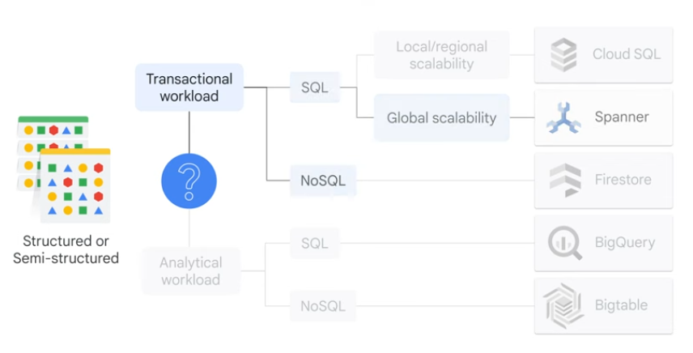

# Study Guide

## 1 Digital Transformation

- **digital transformation**: paradigm shift; when an organization uses new digital technologies to create or modify business processes to meet the needs of changing business and marketing dynamics'
- **cloud**: metaphor for the network of data centers that store and analyze data through internet
- **on-prem**: hosted on site; runs in a locally environment
- **private cloud**: cloud resource dedicated to a single organization; accessed through the internet
  - used when already made infrastructure investments 
  - or regulatory reasons
- **public cloud**: computing services and infrastructure are provided with 3rd parties like Google Cloud
- **hybrid cloud**: combination of different environments (like on-prem & public cloud)
- **multi cloud**: multiple public cloud environments
- **open standard**: software with particular specifications
  - stops vendor lock-in
  - example) ML, HTTP
- **open source**: source code is public, free to use & modify
  - example) Google was behind Kubernetes & TensorFlow
- **total cost of ownership (TCO)**: for on-prem, TCO is associated with the cost of static resources throughout their lifetime
  - the cost of on-prem is dominated by the initial cost of hardware and software
  - but cloud computing is a payed-per-use model
- **CapEx**: *upfront* business expenses put toward fixed assets
- **OpEx**: *recurring* costs for more immediate benefit
- **IP address**: identify a network or the location of a particular device on a network
- **domain name**: easy to remember name that maps to an IP address
- **domain name system (DNS)**: DNS server stores a database of domain names mapped to IP addresses that can be used by computers to communicate with each other
- **bandwidth**: how much data a network can transfer over time; i.e. *width of a pipe*
- **latency**: time it takes for data to travel from one point to another; i.e. *twists and turns in pipe*
- **geographic location** is divided into
  - **regions** which are divided into
  - **zones**; where Google Cloud's resources deployed 
- **network's edge**: where a device or network connects to the internet
- **infrastructure as a service (IaaS)**: offers on-demaind availability of almost infinitely scalable resources
  - such as compute, networking, storage, databases
  - lease resources and only pay for what you use
  - main reasons organizations use IaaS to shift from CapEx to OpEx
  - example) Compute Engine for VMs, Cloud Storage
  - why) highly flexible, maintain control over infrastructure
- **platform as a service (PaaS)**: provides a platform for developers to develop, run, and manage their own applications
  - can use built-in software components
  - reduces the amount of code they need to write
  - example) Cloud Run (server-less platform), BigQuery
  - why) building software products
- **software as a service (SaaS)**: a computing model that offers an entire application offered by a cloud provider through a web browser
  - example) Gmail, Drive, Meet, etc...
  - why) ready to use
- **shared responsibility model**: provider is responsible for security *of* cloud; customer is responsible for security *in* cloud
  - if you configure or store it, you're responsible for securing it.

## 2 Data Transformation

- **structured data**: highly organized & well defined
  - in a table
- **semi-structured data**: organized in a hierarchy; no formal structure; has tags
  - example) email, HTML, JSON, XML
- **unstructured data**: text, images, audio, video
- **database** is an organized collection of data stored electronically.
- **relational database**: has clearly defined schema's
  - relationships
  - SQL to query
- **non-relational database (no-SQL)**: non-tabular
  - flexible data model
  - ideal for data with changing organization
- **data warehouse**: enterprise system used for analysis and reporting of structured and semi structured data from multiple sources
  - example) BigQuery
- **data lake**: repository designed to ingest, store, explore, process, and analyze any type of volume of *raw data*
  - unlike the clean data in data warehouses
- **first-party data**: proprietary customer datasets
- **second-party data**: first-party data from another organization that can easily be deployed to augment a company's internal datasets
- **third-party data**: datasets collected and managed by organizations that don't directly interact with an organization's business
  - often shared on marketplaces like the Google Cloud Marketplace
- data life cycle
  1. **data genesis**: initial creation of a unit of data
  2. **data collection**: data ingested into new system
  3. **data processing**: data is adjusted such as merging datasets together
  4. **data storage**: where the data stores and is ready for analysis and action
     - example) no-SQL, data warehouse, object storage
  5. **data analysis**: provides direction for business oriented action
  6. **data activation**: when an analysis is made, it needs to be pushed to the relevant decision makers
- **data governance**: setting internal standards for how data is managed
  - granting access permissions; complying with external standards
- *for unstructured data*
  - **object storage**: data storage architecture that manages data as “objects”
    - unstructured data 
    - uses globally unique identifier in the form of URLs making it easy to integrate with web technologies
  - **Cloud Storage**: allows customers to store any amount of data 
    - **Standard**: good for hot data or stored for brief time
    - **Nearline**: ~once a month
    - **Coldline**: ~every 90 days
    - **Archive**: ~less than once a year
    - **Autoclass**: 
      - a features that moves data not accessed to colder storage classes to reduce storage cost
      - moves data that is accessed to standard storage to optimize future access
- *for structured data*
  - **Cloud SQL**: fully managed relation databases including MySQL, PostgreSQL, and SQL Server
    - **database migration service (DMS)**: makes it easy to migrate production databases to Cloud SQL with minimum down time
    - **datastream**: synchronize data across databases, storage systems, and applications
  - **Cloud Spanner**: relational database service that is *mission critical* & *scales horizontal*
  - use *Spanner* if
    - have outgrown any relational database
    - are sharding your databases (storing a large database across multiple machines) for throughput high performance
    - need transactional consistency
  - use *Cloud SQL* if
    - don't need horizontal scalng
    - don't need globally available system
  - **BigQuery**: fully managed data warehouse; for storage & analytics (ML, geospatial analysis, BI)
    - encrypted at rest
    - seamless integration with partner ecosystem & mutli-cloud
    - ML models with SQL alone
      - programming Python and Java solutions is not required
    - seamless export to *vertex AI*
- *for semi-structured data*
  - **Google Firestore**
    - flexible, horizontally scaling, NoSQL cloud database
    - can be directly accessed from mobile and web applications
    - provides off-line usage so users can use apps even if disconnected from the Internet
  - **Big Table**
    - NoSQL big data database service
    - same database that powers things like Google Search, Analytics, and Gmail
    - use if
      - working with more than 1 TB of semi-structured or unstructured data
      - data is fast with high throughput or is rapidly changing
      - working with NoSQL
      - data is a time-series or had natural ordering
      - you're running batch or real-time processing on big data
      - you're running ML algorithms on the data 

- is **transactional workload?**
  - stems from OLTP (online transaction processing)
    - fast data inserts and updates are required to build row-based records
    - i.e. points of sale transaction records
- is **analytical workload?**
  - stems from OLAP (online analytical processing)
    - used when entire datasets need to be read
    - often requires complex queries 
    - i.e. analyzing sales history to see trends
- **Looker**: BI platform designed to help individuals and teams analyze, visual, and share data
  - support BigQuery along with 60+ SQL databases
  - provides rich interactive dashboards & reports 
  - web based
- **Pub/Sub**: distributed messaging service that can receive messages from various streams
- **Dataflow**: pipeline to process both streaming data and batch data
  - process refers to steps to extract, transform, and load data or **ETL**
  - a popular solution for pipeline design is **Apache Beam**
    - open source unified programming model to define and execute data processing pipelines, including ETL, batch, and streaming processings

## 3 AI

- *data quality*

  - **Completeness**: whether all required information is present
  - **Uniqueness**: shouldn't have many duplicates
  - **Timeliness**: reflects current state of phenomenon that is being modeled
  - **Validity**: data conforms to a set of predefined standards (type and format)
  - **Accuracy**: correctness of data
  - **Consistency**: whether the data is uniform and doesn't contain contradictory information

- **BigQuery ML**

- **Pre-trained APIs**

  - good for organizations that don't have specialized data scientists but have business analysts and developers
  - fastest and lowest cost of ML approaches but is less customizable 

- **Vertex AI** brings together Google Cloud services for building ML under one unified user interface

- **AutoML**

  - lets you train your own models using a GUIs without code

- **Custom Models**:

  - Vertex AI is also the essential platform for creating custom end-to-end machine learning models
  - this process takes the longest and requires a specialized team of data scientists and engineers

- **TensorFlow**

  - end-to-end open source platform for ML
  - TF takes advantage of **Tensor Processing Unit** (TPU)
  - Google's custom developed application specific certitude to accelerate ML workloads
  - with TPUs, the computing speed increases up to 200 times

- **AI solutions**:

  - **Contact Center AI** provides models for speaking with customers 
  - **Document AI** classifies information from unstructured documents such as invoices, receipts
  - **Discovery AI** for retail uses ML to select the optimal ordering of products on a retailer's e-commerce site
  - **Cloud Talent Solution** uses AI with job search and talent acquisition capabilities

  